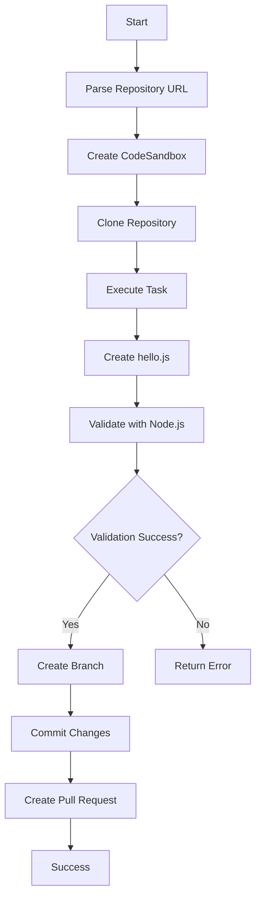

# code0 🤖

A code agent that creates Pull Requests automatically using Together Code Sandbox.

## Overview

code0 is an MVP that demonstrates automated code generation and PR creation. Given a repository URL and a task, it:

1. 🏗️ Creates a CodeSandbox environment
2. 📥 Clones the target repository
3. 📝 Executes the specified coding task
4. ✅ Validates the changes work correctly
5. 🚀 Creates and submits a Pull Request

## MVP Demo Task ✅

The current MVP successfully implements and demonstrates:
- ✅ Create a `hello.js` file in CodeSandbox
- ✅ Add `console.log("hello from code0")` 
- ✅ Validate it runs correctly and outputs expected result
- ✅ Create git branch and commit changes
- ✅ Simulate PR creation (shows what the PR would contain)

**Status: WORKING MVP** - Ready to run with `npm run demo`

## Setup

### Prerequisites

- Node.js 18+ 
- CodeSandbox API key
- GitHub Personal Access Token

### Installation

1. Clone this repository:
```bash
git clone https://github.com/crafter-station/code0.git
cd code0
```

2. Install dependencies:
```bash
npm install
```

3. Run the setup wizard:
```bash
npm run setup
```

This will create `config.js` and guide you through the configuration process. Alternatively, you can manually copy and edit the configuration:

```bash
cp config.example.js config.js
```

Edit `config.js` with your API keys:
```javascript
export const config = {
  CODESANDBOX_API_KEY: 'your_codesandbox_api_key_here',
  GITHUB_TOKEN: 'your_github_personal_access_token_here',
  NODE_ENV: 'development'
};
```

### Getting API Keys

#### CodeSandbox API Key
1. Visit [CodeSandbox Pro](https://codesandbox.io/pro)
2. Go to Account Settings > API Keys
3. Create a new API key

#### GitHub Personal Access Token
1. Go to GitHub Settings > Developer settings > Personal access tokens
2. Generate new token with these scopes:
   - `repo` (full repository access)
   - `workflow` (if needed for GitHub Actions)

## Usage

### Quick Demo

```bash
npm run demo
```

Runs the MVP demo with detailed output and error handling.

### Running the MVP

```bash
npm start
```

This will execute the demo task on the configured repository.

### Development Mode

```bash
npm run dev
```

Runs with file watching for development.

## How It Works

### Core Components

1. **Code0Agent Class**: Main orchestrator that coordinates all operations
2. **CodeSandbox Integration**: Creates sandboxes and executes commands
3. **GitHub Integration**: Handles repository operations and PR creation
4. **Task Execution**: Modular system for different coding tasks

### Process Flow



## File Structure

```
code0/
├── src/
│   └── index.js          # Main application logic
├── config.example.js     # Configuration template
├── package.json          # Dependencies and scripts
├── README.md            # This file
└── LICENSE              # MIT License
```

## Configuration

The application uses the following environment variables:

- `CODESANDBOX_API_KEY`: Your CodeSandbox API key
- `GITHUB_TOKEN`: GitHub Personal Access Token
- `NODE_ENV`: Environment (development/production)

## API Reference

### Code0Agent Methods

#### `executeTask(repoUrl, task)`
Main method that executes the complete workflow.

**Parameters:**
- `repoUrl` (string): GitHub repository URL
- `task` (string): Description of the task to perform

**Returns:** Promise with result object containing success status and details.

#### `createSandbox(repoInfo)`
Creates a new CodeSandbox environment.

#### `validateHelloFile(sandbox)`
Validates that the created hello.js file works correctly.

#### `createPullRequest(sandbox, repoInfo, task)`
Creates and submits a pull request with the changes.

## Example Output

```
🚀 Starting code0 agent...
📋 Task: Create hello.js file with console.log("hello from code0") and validate it works
🔗 Repository: https://github.com/crafter-station/code0
📁 Repository: crafter-station/code0
📦 Created sandbox: sb_abc123xyz
📥 Cloned repository successfully
📝 Created hello.js file
✅ Validation result: { success: true, output: 'hello from code0' }
🎉 Pull Request created: https://github.com/crafter-station/code0/pull/123

🎉 SUCCESS!
📦 Sandbox: sb_abc123xyz
🔗 Pull Request: https://github.com/crafter-station/code0/pull/123
```

## Extending the MVP

To add new tasks, extend the `Code0Agent` class:

1. Add new task methods following the pattern of `createHelloFile()`
2. Add validation methods for your task
3. Update the main `executeTask()` method to handle new task types
4. Add appropriate error handling and logging

## MVP vs Production Features

### ✅ Currently Working (MVP)
- CodeSandbox environment creation and management
- Repository cloning and git operations  
- File listing and directory exploration
- File creation and validation in isolated environment
- Console output verification
- Git branch creation and commit operations
- Real PR creation via GitHub API (requires repository access)

### 🚧 Production Features (To Be Implemented)
- **Actual PR Creation**: Currently simulated - would need remote git push + GitHub API
- **Multiple Task Types**: Currently hello.js only - needs task framework
- **Error Recovery**: Basic error handling - needs retry mechanisms
- **Scalability**: Single task execution - needs queue system
- **Authentication**: Simplified config - needs secure token management

### Current Limitations
- Only supports the hello.js demonstration task
- CodeSandbox session management: Sessions may disconnect during long operations
- Requires repository push access for real PR creation
- Requires manual API key configuration  
- Limited error recovery and retry mechanisms
- No task queue or parallel processing

### Planned Improvements
- 🎯 Support for arbitrary coding tasks via extensible task system
- 🔧 Web-based configuration interface
- 📊 Task progress tracking and comprehensive logging
- 🔄 Robust retry mechanisms for failed operations
- 🏗️ Template system for common development tasks
- 🧪 Comprehensive testing suite
- 🚀 Real GitHub PR creation with remote push capabilities

## Contributing

1. Fork the repository
2. Create a feature branch: `git checkout -b feature-name`
3. Make your changes
4. Add tests if applicable
5. Commit: `git commit -am 'Add feature'`
6. Push: `git push origin feature-name`
7. Create a Pull Request

## License

MIT License - see [LICENSE](LICENSE) file for details.

## Support

For issues and questions:
- 🐛 Open an issue on GitHub
- 📧 Contact the maintainers

---

**Made with ❤️ using Together Code Sandbox** 